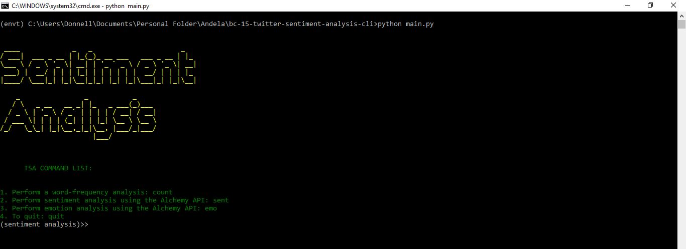

### bc-15-twitter-sentiment-analysis-cli

# *Twitter Sentiment Analysis*

Twitter is a popular online news and social networking service where registered users can share and interact with short SMS-like messages called "tweets" restricted to 140 characters, and unregistered can only read them. Users share thoughts, links and pictures on Twitter, journalists comment on live events, companies promote products and engage with customers. Each day millions of people tweet to express their opinions across any topic imaginable. This data source is valuable for both research and business. Analysis conducted on the data can show the reaction of people towards products or services, and can also be used for trend analysis. Twitter provides a very rich REST API for querying the system, accessing data, and controling your account.

This Command Line Application runs on Python 3 and has not been tested on Python 2. In case of any errors when running the script in Python 2, kindly make the necessary updates to the scripts after you clone the repository.
https://github.com/TinaMor/bc-15-twitter-sentiment-analysis-cli/

About the Application
The CLI has a list of commands that perform the various tasks that were required for this project.
1. Use the Twitter API to fetch tweets for a particular user and save them in JSON file (for a given period e.g. 1 week or 1 month depending on the volume).
2. Show % progress as the Twitter API is fetching the tweets.
3. Perform a word-frequency analysis and list the words with their frequency starting from the highest to the lowest. Exclude stop-words.
    - Due to the amount of data returned, we will only look at the top 10 words used
    - To view the list of stop words used, see stop_words_list.txt in the repo
4. Perform sentiment analysis using the Alchemy API [extra credits]

Additionally, this application performs an emotions analysis on tweets
5. Emotions analysis

Installation
The requirements.txt file has the list of all libraries that you need to install to run this application. On your environment or commandline, run the command:

            pip3 install -r requirements.txt

Running the application
On your command line, run the command:
            
            python main.python

You should see the following:

